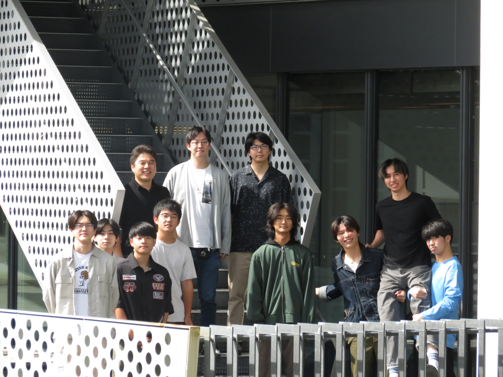

# 建築材料・施工研究室 ホームページ

静岡理工科大学 理工学部 建築学科の研究室ホームページです。

**URL:** https://meta-ochir.github.io/E-lab/

## コンテンツ更新ガイド

このサイトはJSON形式のデータファイルで内容を管理しています。写真、論文、ニュースなどは、GitHub上で直接編集できます。

---

## 📝 コンテンツ編集方法

### 1. メンバー情報の編集 (`data/members.json`)

**研究室メンバー、学年、写真を更新します。**

**GitHubでの編集手順:**
1. GitHub上で `E-lab` リポジトリを開く
2. `data/members.json` をクリック
3. 右上の編集アイコン（✏️）をクリック
4. 内容を編集
5. 下のコミットボタンで保存

**編集例:**
```json
{
  "year": "2026",
  "professor": {
    "name": "エルドンオチル",
    "nameEn": "E Ridengaoqier",
    "photo": "images/professor.jpeg",
    "affiliation": "静岡理工科大学 理工学部 建築学科",
    "specialty": "建築材料学・コンクリート工学・非破壊検査・AI応用",
    "research": "...",
    "degree": "博士（工学）..."
  },
  "students": [
    {
      "name": "学生名",
      "grade": "4年生",
      "photo": "images/student-name.jpg"
    }
  ]
}
```

### 2. ニュース・お知らせ (`data/news.json`)

**最新のニュースや受賞情報を追加します。**

**編集例:**
```json
[
  {
    "date": "2026-04",
    "category": "AWARD",
    "title": "○○賞を受賞",
    "description": "説明文",
    "image": "images/news-image.jpg",
    "link": "https://example.com"
  }
]
```

- `date`: YYYY-MM形式
- `category`: "AWARD" または "NEWS"
- `image`, `link`: オプション（空文字列でもOK）

### 3. 研究テーマ (`data/research.json`)

**研究テーマの説明やPDF、画像を更新します。**

**編集例:**
```json
[
  {
    "title": "テーマ名",
    "titleEn": "Theme Name",
    "icon": "concrete",
    "description": "詳しい説明",
    "tags": ["タグ1", "タグ2"],
    "image": "images/research-image.jpg",
    "pdf": "files/research-paper.pdf"
  }
]
```

- `icon`: concrete / ai / eco / mobile / wood / thermal のいずれか
- `image`, `pdf`: オプション（空文字列でもOK）

### 4. 動画 (`data/videos.json`)

**YouTube動画を埋め込みます。**

**編集例:**
```json
[
  {
    "title": "動画タイトル",
    "description": "動画の説明",
    "embedId": "YouTubeの動画ID",
    "thumbnail": "images/thumbnail.jpg",
    "date": "2025"
  }
]
```

- `embedId`: YouTubeのURL（https://www.youtube.com/watch?v=**ここ**）の部分
- `thumbnail`, `date`: オプション

### 5. 論文・発表 (`data/publications.json`)

**論文や学会発表の一覧を管理します。**

**編集例:**
```json
{
  "reviewed": [
    {
      "year": 2025,
      "items": [
        "著者, タイトル, 雑誌/会議, Vol.XX, pp.XX-XX, 2025.X"
      ]
    }
  ],
  "international": [...],
  "domestic": [...]
}
```

---

## 🖼️ 写真・PDFのアップロード

### 写真の追加

1. **GitHubで `images/` フォルダを開く**
2. **"Add file" → "Upload files" をクリック**
3. **写真ファイルを選択・ドラッグ&ドロップ**
4. **ファイル名を確認して Commit**
5. **JSONファイルで参照:** `"photo": "images/ファイル名.jpg"`

### PDFのアップロード

1. **GitHubで `files/` フォルダを開く** （なければ新規作成）
2. **"Add file" → "Upload files" で PDF をアップロード**
3. **JSONファイルで参照:** `"pdf": "files/ファイル名.pdf"`

---

## 📂 ファイル構成

```
.
├── index.html           # メインページ
├── style.css            # スタイル（変更不要）
├── script.js            # スクリプト（変更不要）
├── README.md            # このファイル
├── data/
│   ├── members.json     # メンバー情報
│   ├── news.json        # ニュース
│   ├── research.json    # 研究テーマ
│   ├── videos.json      # 動画
│   └── publications.json # 論文
├── images/              # 写真（メンバー、ニュース等）
└── files/               # PDF（論文、資料等）
```

---

## 🚀 更新の反映

1. **JSONファイルを編集・コミット**
2. **GitHub Pages が自動的に再構築** （1分以内）
3. **ブラウザをリロード** して確認

*キャッシュが残っていたら `Ctrl+Shift+R` で強制リロード*

---

## ⚙️ 詳細な設定

### ヒーロー画像の変更

`index.html` の以下の行を編集:
```html

```

`images/hero.jpg` を別の写真に置き換えてください。

### サイトタイトル・説明の変更

`index.html` の以下の行を編集:
```html
<h1 class="hero-title">
  <span class="hero-highlight">建築材料・施工研究室</span>
</h1>
<p class="hero-subtitle">Architectural Materials & Construction Laboratory</p>
```

### マーキーテキストの変更

`index.html` の以下の部分を編集:
```html
<div class="marquee-content">
  <span>ポーラスコンクリート</span>
  <span>•</span>
  <span>AI診断</span>
  ...
</div>
```

---

## 💡 Tips

- **日本語の文字化けが起こった場合**: ブラウザのキャッシュをクリアしてください
- **画像が表示されない**: ファイル名とパスが正しいか確認してください（大文字小文字区別）
- **GitHubの編集がうまくいかない**: 左上の「Code」→「Edit in GitHub Web」でリトライ

---

## 📞 サポート

ご不明な点がありましたら、お気軽にお尋ねください。

---

**最終更新:** 2026年4月
